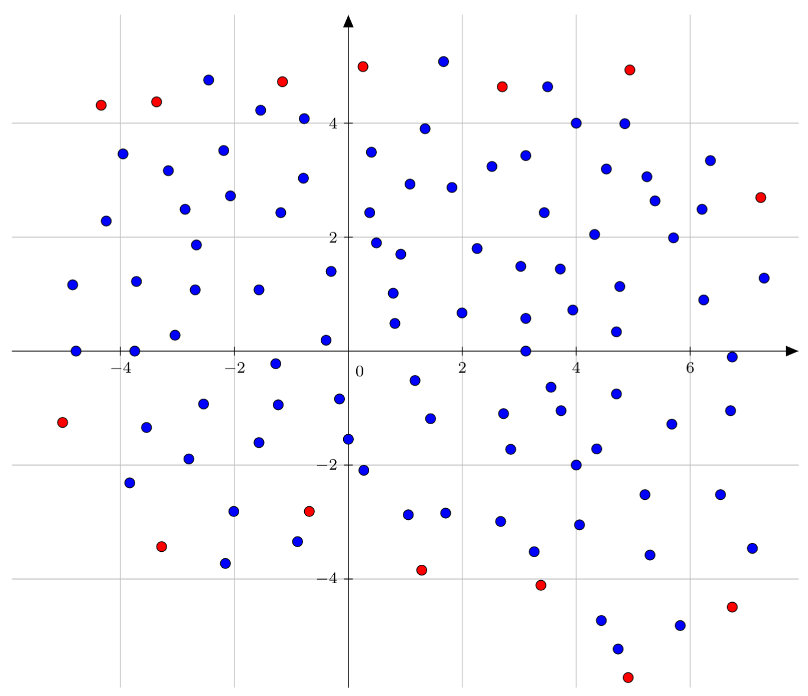
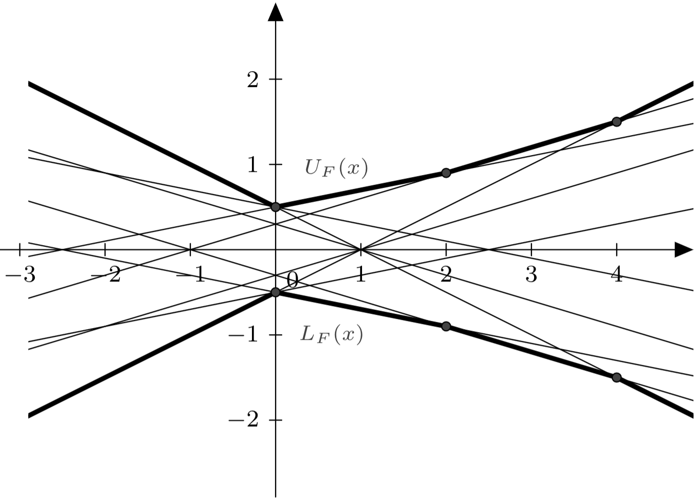

<!-- $theme: default -->

Computational Geometry:
The Framework of Coresets
===

	

#### Project presentation - April '17
#### Charles Hamesse

<!-- *page_number: false -->

---

<!-- page_number: true -->
# Subjects

1. About geometric approximations
2. Envelopes and extent measures
3. Directions and directional widths
4. A simple coreset construction 
5. An improved construction
6. Implementation

---
# 1. About geometric approximations

---
#### About geometric approximations: an introduction

Usual technique to develop approximation algorithms: 
- extract small amounts of **relevant** information from the input data
- perform relatively-heavy computation on this extracted data.

<!-- Narrated 
For example, we could think of random sampling, convex approximation, surface simplification or feature extraction. -->

If the input is a set of points, the question can be reduced to finding a small subset - a **coreset** - of the points, such that one can perform the desired computation on the coreset.

---

#### About geometric approximations: a state of the art

Considerable work has been done on measuring various descriptors of the extent of a set $P$ of $n$ points in $\mathbb{R}^d$. 

- Exact algorithms for computing extent measures are generally expensive. 
<!-- Narrated
For instance said by the authors
-->
- It is said that the best known algorithms for computing the smallest volume bounding box or tetrahedron containing $P$ in $\mathbb{R}^d$ require $O(n^d)$ time.

---

#### About geometric approximations: the goal

Ideally, one would like to argue that:
- for any extent measure $\mu$ 
- for any paramater $\varepsilon$ such that $0 < \varepsilon < 1$

There exists a subset $Q \in P$ with $|Q| = 1/\varepsilon^{O(1)}$ such that $\mu(Q) \geq (1 - \varepsilon) \mu(P)$

--- 

#### About geometric approximations: an example coreset

	

<!-- Narrated
Example of coreset constructed on a grid, remark that each cell of the grid has at most 1 point belonging to the coreset
-->

Both red and blue points belong to $P$, red points belong to $P$'s coreset $Q$.

---

# 2. Envelopes and extent measures

--- 

#### Envelopes and extent measures: intuition

---

#### Envelopes and extent measures: formal definition of envelopes

Let  $F = \{ f_1, ..., f_n \}$ be a set of $n$ $d$-variate functions defined over $x = (x_1, ..., x_d) \in ~\mathbb{R}^{d}$:

1. The **lower envelope** of $F$ is the graph of the function:
$$
L_F : \mathbb{R}^{d} \rightarrow \mathbb{R} : x \rightarrow \min_{f \in F} f(x)
$$

2. The **upper envelope** of $F$ is the graph of the function:
$$
U_F : \mathbb{R}^{d} \rightarrow \mathbb{R} : x \rightarrow \max_{f \in F} f(x)
$$

---

#### Envelopes and extent measures: formal definition of extents

The **extent** is defined as:

$$
J_F : \mathbb{R}^{d} \rightarrow \mathbb{R} : x \rightarrow U_F(x) - L_F (x)
$$

Now let's introduce a parameter $\varepsilon > 0$ and let $\Delta$ be a subset of $\mathbb{R}^{d}$. The $\varepsilon$-approximation of the extent of $F$ within $\Delta$ is the subset $G$ such that, for each $x \in \Delta$:

$$
(1 - \varepsilon) J_F (x) \leq J_G(x)
$$

**Observation:** $J_G(x) \leq J_F(x)$, as $G \subseteq F$.  

If $\Delta = \mathbb{R}^{d}$, this is simply an $\varepsilon$-approximation of the extent of $F$.

---

# 3. Directions and directional widths

---
#### Directions and directional widths: intuition

	

---
#### Directions and directional widths: directions and the $n$-sphere

**Observation:** Directions can be expressed as unit vectors on a $n$-dimensional sphere. 

The $n$-sphere is the generalization of the ordinary sphere to spaces of arbitrary dimension. It is an $n$-dimensional manifold that can be embedded in Euclidean  $(n+1)$-space. 

It is defined by:

$$
\mathbb{S}^n~= \{ x \in~ \mathbb{R}^{n+1} : |x| = r\}
$$

<!-- 
For any natural number $n$, an $n$-sphere of radius  $r$ may be defined in terms of an embedding in $(n+1)$-dimensional Euclidean space as the set of points that are at distance $r$ from a central point, where the radius $r$ may be any positive real number. 
-->

So our "usual" sphere is really a 2-sphere, or $\mathbb{S}^2$.

---
#### Directions and directional widths: formal definition of directional widths

Let $\mathbb{S}^{d-1}$ be the unit sphere centered at the origin in $\mathbb{R}^d$. For any direction $u \in~ \mathbb{S}^{d-1}$ and a point set $P \subseteq ~\mathbb{R}^d$, we define the **directional width** as:

$$
\omega (u, P) = \max_{p \in P} \langle u, p \rangle - \min_{p \in P} \langle u, p \rangle
$$

where $\langle \cdot, \cdot \rangle$ is the usual inner product.

<!-- Narrated
Here, show the illustration again -->

---
#### Directions and directional widths: an approximation of directional widths

Let's again introduce a parameter $\mu > 0$ and set $\Delta \subseteq ~\mathbb{R}^{d}$. 

A set $Q \subseteq P$ is a $\mu$-approximation of $P$ within $\Delta \subseteq ~\mathbb{R}^d$ if, 
for each $u \in \Delta$:
<!-- typo -->

$$
(1 - \mu) \omega(u, P) \leq \omega(u, Q)
$$

---

# 4. A simple coreset construction

---

#### A simple coreset construction: roadmap

In the litterature, it is shown that:
1. Any point set can be turned into an $\alpha$-fat point set using a linear non-singular transform.
>*"Let  $P$ be a set of $n$ points in $\mathbb{R}^d$ and let $\varepsilon$ be a parameter. There exists a linear non-singular transform $T$ such that $T(P)$ is  $\alpha_d$-fat, where $\alpha_d$ is a constant depending only on $d$."*

2. There exists an algorithm for computing coresets of $\alpha$-fat point sets.
> *"Let $P$ be a  $\alpha$-fat point set contained in $C$. For any $\varepsilon > 0$, we can compute, in $O(n+1 / ( \alpha \varepsilon)^{d-1} )$ time, a subset  $Q \subseteq P$ of  $O(1/(\alpha \varepsilon)^{d-1})$ points that $\varepsilon$-approximates $P$."*

<!-- 
Lemmas 1 and 2 imply that it suffices to describe an algorithm for computing an ε-approximation of an 
α-fat point set for some  α<1. Without loss of generality, we assume that  C⊃P⊃[−α,α]d. 
-->

---
#### A simple coreset construction: fat point sets

A point set $P$ is $\alpha$-fat if there exists a point  $p \in~ \mathbb{R}^d$ and a hypercube $\mathbb{C}$ centered at the origin so that:

$$
p+ \alpha \mathbb{C} \subset CH(P) \subset p+ \mathbb{C}
$$

So in this sense, an $\alpha$-fat point set is just a non-empty set of points whose convex hull:
- contains the hypercube of edge length $\alpha$ centered at the origin,
- is contained in the unit hypercube.

---
#### A simple coreset construction: the algorithm
Consider a $d$-dimensional grid $\mathbb{Z}$ of size $\delta = \frac{\varepsilon  \alpha}{6 \sqrt{d}}$. That is:
<!-- N
Explain parameters
-->
$$
\mathbb{Z} = \{ (\delta i_1, ..., \delta i_d) | i_1, ..., i_d \in \mathbb{Z} \}
$$

- For each column along the $x_d$-axis in $\mathbb{Z}$, pick one point from both extreme nonempty cells and add them to $Q$.
- Clearly, the Hausdorff distance between $Q$ and $P$ is smaller than $\frac{\varepsilon  \alpha}{6}$ and $Q$ makes an $\varepsilon$-approximation of $P$.
<!-- Narrated
Demo -->
- It can be shown that $|Q| = O(1/(\alpha \varepsilon)^{d-1})$, so $Q$ can be constructed in time $O(n + 1/(\alpha \varepsilon)^{d-1})$.
<!-- Narrated: provided ceiling in constant time -->

---

#### A simple coreset construction: the Hausdorff distance

It is defined as:

$$
d_H(X,Y) = \max\{\,\sup _{{x\in X}}\inf _{{y\in Y}}d(x,y),\,\sup _{{y\in Y}}\inf _{{x\in X}}d(x,y)\,\}
$$

	

**Intuition:** it is, in a way, the greatest of all the distances from a point in one set to the closest point in the other set.

<small>Illustration by Rocchini - Own work, CC BY 3.0, https://commons.wikimedia.org/w/index.php?curid=2918812
</small>

---

#### A simple coreset construction: an example

	

---

# 5. An improved construction

---

#### An improved construction: the algorithm 

Let $S$ be the sphere of radius $\sqrt{d + 1}$ centered at the origin and set $\delta = \sqrt{\varepsilon \alpha} \leq 1/2$. 

- One can construct a set $J$ of $O(1  / \delta^{d-1})$ points on $S$ so that: 
$$
\forall x \in S, ~\exists y \in J : ||x - y || \leq \delta
$$
<!-- 
for any point $x$ on $S$, there exists a point $y \in J$ such that $||x - y|| \leq \delta$. -->
- We process $P$ into a data structure that can answer $\varepsilon$-approximate nearest-neighbor queries.
- K-d trees allow exact nearest-neighbor queries.

---

#### An improved construction: the algorithm (2) 
For a query point $q$, let $\phi(q)$ be the point of $P$ returned by this data structure. 

- For each point $y \in J$, compute $\phi (y)$
- Return the set $Q = \{ \phi(y) | y \in J \}$.

---

#### An improved construction: an example

	

<!-- 
Narrated:
See how the diagonal widths should be a bit smaller than those of the original point set. 
-->

---
# 6. Implementation

---

#### Implementation: computing the error

For a set of directions $\Delta$, the error is defined as:

$$
err(Q, P) = \max_{u \in \Delta} \frac{\omega(u,P) - \omega(u,Q)}{\omega(u, P)}
$$

- Intuitively, it is the maximum value amongst all relatives errors on the directional width for all directions $u$ in $\Delta$. 
- Accuracy rises with the number of directions considered.
- Authors use 1000 directions in a 4D space. 
- I implemented 4 directions in a 2D space: the horizontal, the vertical and both diagonals.

<!-- Narrated: how the number of needed directions rises with dimension number, how this should be enough for the proof of concept -->

---

#### Implementation: demo
<!-- 
2. Envelopes and extent measures
3. Directions and directional widths
4. A simple coreset construction
5. An improved coreset construction
6. Implementation
-->

---

# Questions?